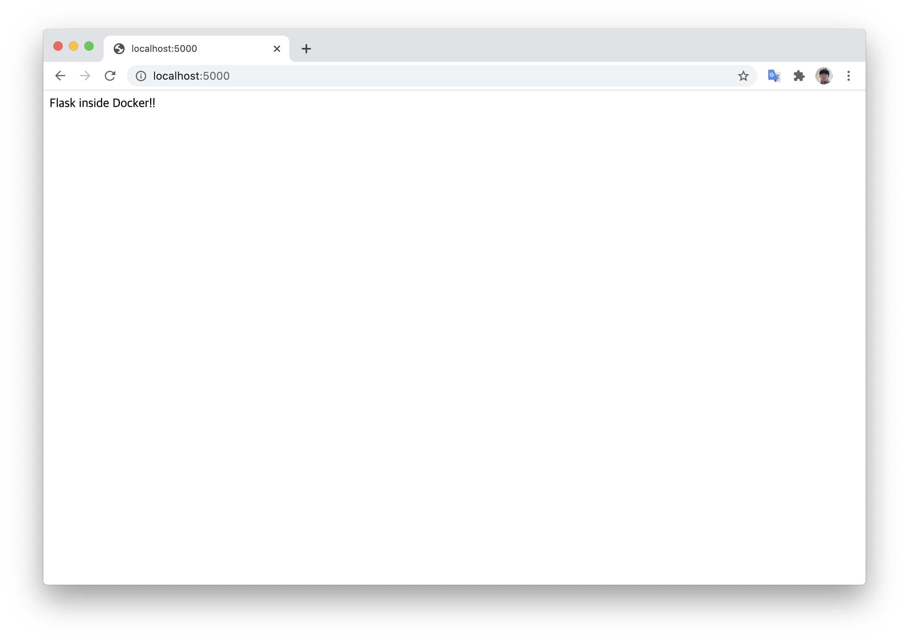

# DockerTutorial
Simplest Docker Tutorial

# Hello World
We will use https://github.com/shekhargulati/python-flask-docker-hello-world



```
git clone https://github.com/shekhargulati/python-flask-docker-hello-world.git
cd python-flask-docker-hello-world
docker build -t simple-app .
docker run -it -p 5000:5000 simple-app
```

# Installing Docker on Ubuntu
```
curl -fsSL https://download.docker.com/linux/ubuntu/gpg | sudo apt-key add -
sudo add-apt-repository \
   "deb [arch=amd64] https://download.docker.com/linux/ubuntu \
   $(lsb_release -cs) \
   stable"
sudo apt-get update
sudo apt-get install docker-ce
sudo usermod -aG docker $USER
```
## Installing nvidia-docker
```
distribution=$(. /etc/os-release;echo $ID$VERSION_ID)
curl -s -L https://nvidia.github.io/nvidia-docker/gpgkey | sudo apt-key add -
curl -s -L https://nvidia.github.io/nvidia-docker/$distribution/nvidia-docker.list | \
sudo tee /etc/apt/sources.list.d/nvidia-docker.list

sudo apt-get update && sudo apt-get install -y nvidia-container-toolkit
sudo systemctl restart docker
```

# Essential Commands
### Preparing Image
Check https://hub.docker.com/search?q=&type=image
```
docker pull <image_name>  # Download image from docker hub
docker images  # Show all images
```

### Running
#### Simple Run
**Running shell directly. Check <image_name> from ```docker images```**
```
docker run -it <image_name> /bin/bash
```
Example
```
docker run -it ubuntu
```

#### Running shell background daemon
```
docker run -it -d <image_name>
```

#### Running with GPUs
```
docker run --gpus all -it <image_name> /bin/bash
docker run --gpus 2 -it <image_name> /bin/bash  # Run two gpus available.
docker run --gpus '"device=0,1,2,3"' -it <image_name> /bin/bash  # Run 4 GPU id=0,1,2,3
```

#### Exit shell without stopping container.
```
<CTRL+P> + <CTRL+Q>
```

#### Share storage with system
```
docker run -v <system_directory>:<container_directory> ...
```
Example
```
docker run -it -v /home/yoongi/Projects:/data pytorch/pytorch:latest /bin/bash
```

#### Expose port
```
docker -p <system_port>:<container_port> ...
```
Example
```
docker run -it -p 5555:5555 -p 5556:5556 --gpus 1 yoongicomcomai/bert-as-service-base:latest /bin/bash
```

#### Using GUI programs such as cv2.imshow()
```
xhost +local:docker
docker run -v /tmp/.X11-unix:/tmp/.X11-unix -e DISPLAY=$DISPLAY -e QT_X11_NO_MITSHM=1
```

### Check running containers
```
docker ps  # Check running containers
docker ps -a  # Show all containers including stopped containers
```

### Save running container as image
```
docker commit <container_id> <username/imagename:tag>  # Save running docker as image
docker stop <container_id>  # Check 'docker ps'
docker rm <container_id>  # Delete a stopped container. Check 'docker ps -a'
```

### Upload to DockerHub
Sign up https://hub.docker.com/
```
# 1. Rename local image same as dockerhub name
docker tag <image_name:tag> <dockerhub_username/imagename:tag>

# 2. Login to docker hub
docker login

# 3. Push layers
docker push <dockerhub_username/imagename:tag>
```

### Delete docker image
```
# 1. Check what image to delete
docker images

# 2. Delete an image. ### Becarefull Not to delete other's images ###
docker rmi <image_id>
```

### Build Dockerfile
```
docker build -t <image_name> <path to directory containing Dockerfile>
```

# How to make Dockerfile
### Example of Dockerfile
https://github.com/Laeyoung/Zooming-Slow-Mo-CVPR-2020/blob/master/Dockerfile
```
# 1. base image
FROM pytorch/pytorch:1.1.0-cuda10.0-cudnn7.5-devel

# 2. apt install
# Each time RUN docker creates intermediate container. Use '\' to coninuously run commands.
RUN apt update && \
  apt install -y git wget ffmpeg libsm6 libxext6 libxrender-dev libglib2.0-0

# 3. pip install
COPY ./pip.conf ~/.pip/pip.conf
RUN pip install numpy opencv-python lmdb pyyaml pickle5 matplotlib seaborn

# 4. install flask and expose 80 port
RUN pip install flask Flask-Limiter
EXPOSE 80

# 5. download pre-trained model
RUN mkdir /app
WORKDIR /app
RUN wget --no-check-certificate 'https://docs.google.com/uc?export=download&id=1xeOoZclGeSI1urY6mVCcApfCqOPgxMBK' -O model.pth

# 6. copy codes
COPY . .

# 7. set ENTRYPOINT and CMD
ENTRYPOINT bash /app/entrypoint.sh
CMD []
```
```
docker build -t <yoongi/zooming-slow-mo:latest> ./Dockerfile
```

### Dockerfile commands (FROM, RUN, WORKDIR, CMD, ...)
https://rampart81.github.io/post/dockerfile_instructions/


# Example Situation (Flask app)
### 1. Pull python3 docker image
```
docker pull python:3.8.3-slim
```
### 2. Run docker image
```
docker run -it python/python:3.8.3-slim /bin/bash
```
### 3. Install git & clone repository
```
apt update
apt install git
git clone https://github.com/YoongiKim/DockerTutorial.git
cd DockerTutorial/
ls -al
```
### 4. Install Flask by pip
```
pip install flask
```
### 5. Run Flask app
```
python app.py
```
### 6. Test web page
Connect web-browser to 127.0.0.1:5000
(It won't connect)
### 7. Expose port 5000
We didn't opened port 5000. So we should save, stop, re-run with `-p 5000:5000` option
#### 7-1. Exit without stopping container.
If we just exit we will lose changes. So press key CTRL+P + CTRL+Q
```
<CTRL+P> + <CTRL+Q>
```
#### 7-2. Show running containers
```
docker ps
```
Then it will show you running containers
```
CONTAINER ID        IMAGE               COMMAND                  CREATED             STATUS              PORTS               NAMES
e0bbebd22254        python:3.8.3-slim   "/bin/bash"              7 minutes ago       Up 7 minutes                            blissful_borg
```
#### 7-3. Save changes
```
# docker commit <CONTAINER ID> <NEW IMAGE NAME>
docker commit e0bbebd22254 simple-app:latest
```
#### 7-4. Stop running container
```
docker stop e0bbebd22254
```
#### 7-5. Re-Run with 5555 port opened
```
# -p outside_port:inside_port
docker run -it -p 5555:5555 simple-app:latest /bin/bash
```

#### 7-6. Test web site again
Connect web-browser to 127.0.0.1:5000

### 8. Push
Now we can upload our own image to docker hub.
```
docker images
docker tag simple-app:latest yoongicomcomai/simple-app:latest
docker login
docker push yoongicomcomai/simple-app:latest
```

### 9. Pull
Later we can download our image
```
docker pull yoongicomcomai/simple-app:latest
```

### 10. Dockerfile making
If you want to make Dockerfile what we've done
```
FROM python:3.8.3-slim
RUN apt update && \
    apt -y install git && \
    git clone https://github.com/YoongiKim/DockerTutorial.git && \
    pip install flask
EXPOSE 5000
WORKDIR /DockerTutorial
ENTRYPOINT ["python"]
CMD ["app.py"]
```
```
docker build -t simple-flask-app .
docker run -it -p 5000:5000 simple-flask-app
```
